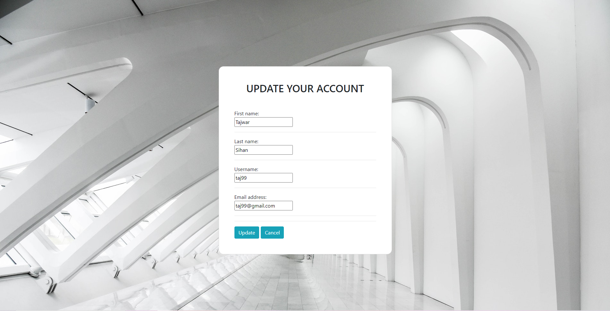

# CRUD_operation
This django based project is focused on create, read, update and delete operation

Home page without logging in

Registration page

Login page

Home page with login

Update page

Delete page

